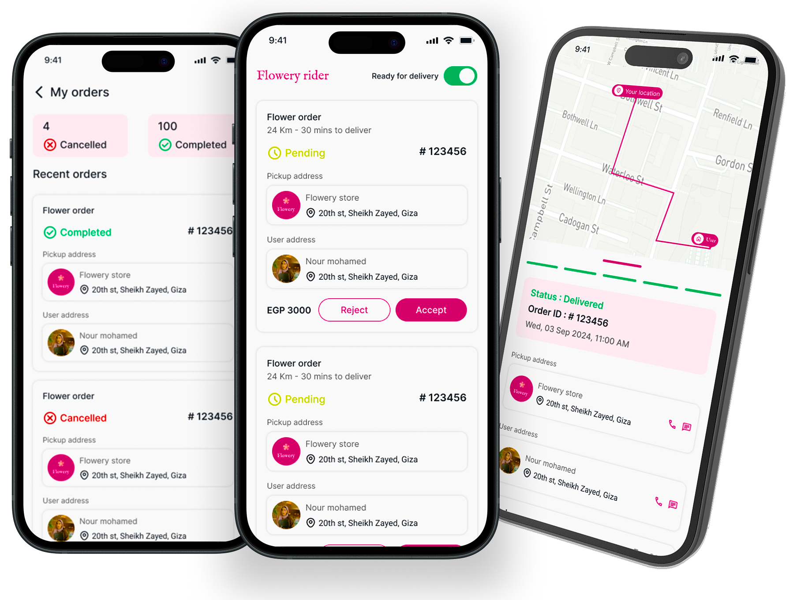

# Tracking App 🚚



A comprehensive Flutter application for tracking orders and managing deliveries. This app provides a seamless experience for users to track their shipments in real-time, manage orders, and update their profile.

## 📸 Screenshots

| Onboarding | Login | Home | Order Details |
|:---:|:---:|:---:|:---:|
|  |  |  |  |

## ✨ Features

- **🔐 Authentication**: Secure login and registration using Firebase Auth.
- **📦 Order Management**: View active and past orders with detailed statuses.
- **📍 Real-time Tracking**: Interactive Google Maps integration for tracking shipments.
- **🌐 Localization**: Full support for Arabic and English languages.
- **🎨 Theming**: Light and Dark mode support for a personalized experience.
- **👤 Profile Management**: Update personal details and manage preferences.
- **📱 Responsive Design**: Optimized for various screen sizes using `flutter_screenutil`.

## 🛠️ Tech Stack

- **Framework**: [Flutter](https://flutter.dev/)
- **Language**: [Dart](https://dart.dev/)
- **State Management**: [Flutter Bloc](https://pub.dev/packages/flutter_bloc)
- **Dependency Injection**: [GetIt](https://pub.dev/packages/get_it) & [Injectable](https://pub.dev/packages/injectable)
- **Networking**: [Dio](https://pub.dev/packages/dio) & [Retrofit](https://pub.dev/packages/retrofit)
- **Local Storage**: [Shared Preferences](https://pub.dev/packages/shared_preferences) & [Flutter Secure Storage](https://pub.dev/packages/flutter_secure_storage)
- **Backend**: [Firebase Core](https://pub.dev/packages/firebase_core) & [Firestore](https://pub.dev/packages/cloud_firestore)
- **Maps**: [Google Maps Flutter](https://pub.dev/packages/google_maps_flutter)

## 🚀 Getting Started

### Prerequisites

- [Flutter SDK](https://docs.flutter.dev/get-started/install)
- [Dart SDK](https://dart.dev/get-dart)
- [Android Studio](https://developer.android.com/studio) or [VS Code](https://code.visualstudio.com/)

### Installation

1. **Clone the repository:**
   ```bash
   git clone https://github.com/lbarsidati22/tracking_app.git
   cd tracking_app
   ```

2. **Install dependencies:**
   ```bash
   flutter pub get
   ```

3. **Generate code (for Retrofit, Freeze, etc.):**
   ```bash
   dart run build_runner build --delete-conflicting-outputs
   ```

4. **Run the app:**
   ```bash
   flutter run
   ```

## 📂 Project Structure

```text
lib/
├── core/            # Core utilities, DI, network, theme
├── features/        # Feature-based modules (Auth, Home, Orders, etc.)
├── main.dart        # Entry point
└── firebase_options.dart # Firebase configuration
```

## 🤝 Contributing

Contributions are welcome! Please fork the repository and submit a pull request.

---

<center>
  Made with ❤️ using Flutter
</center>
